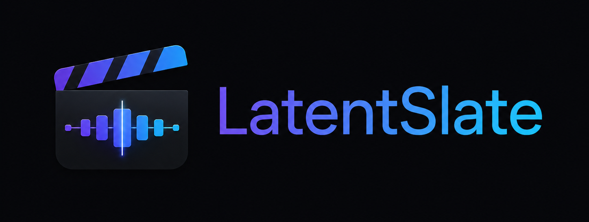
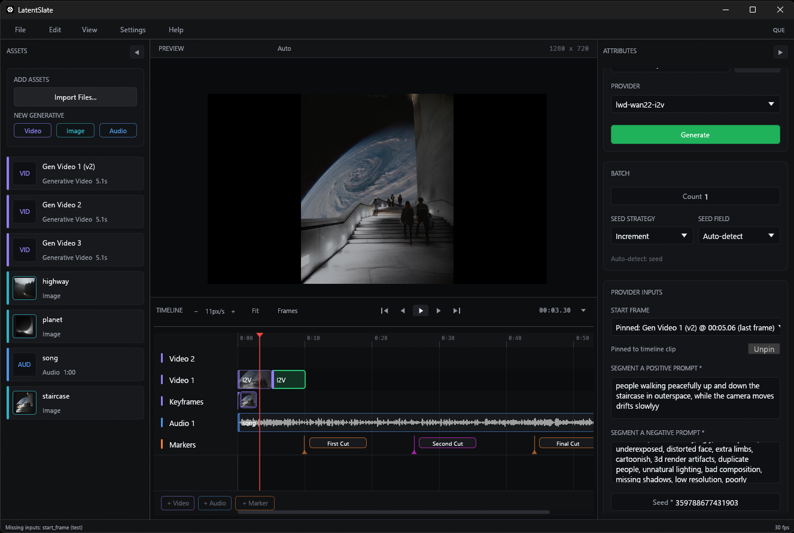
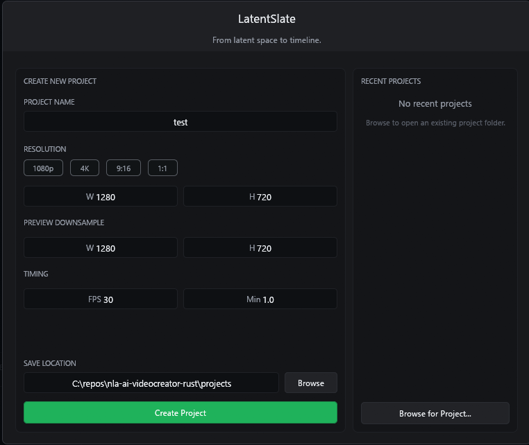
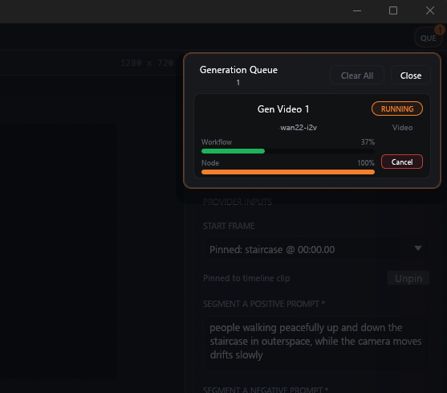
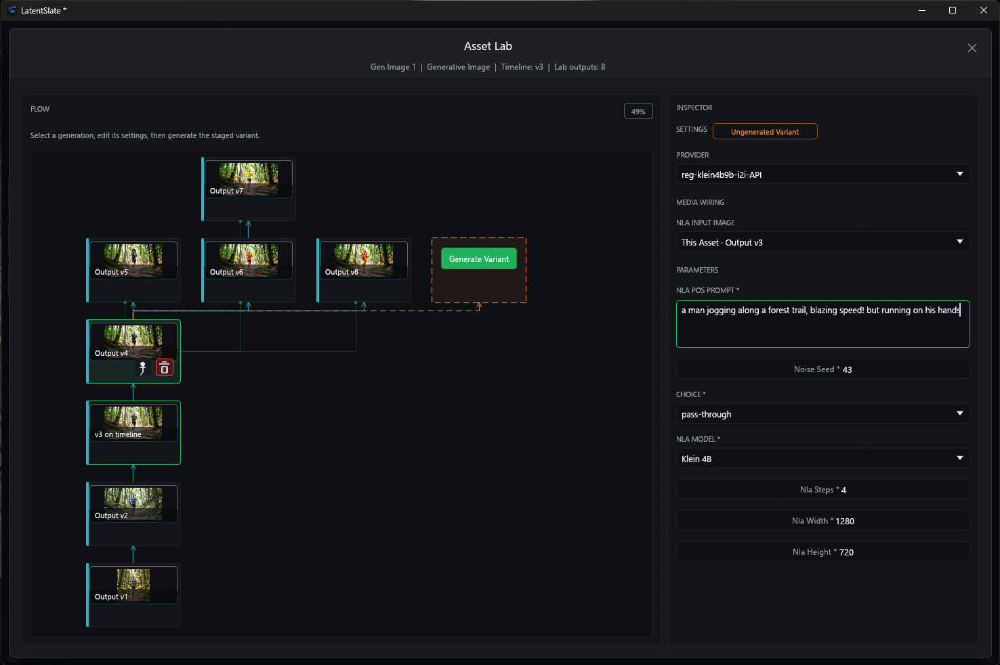
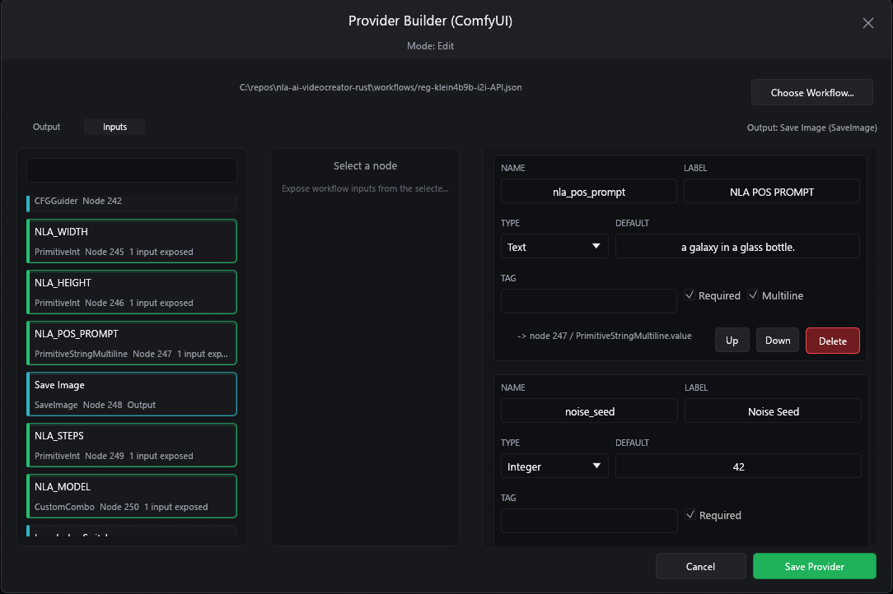
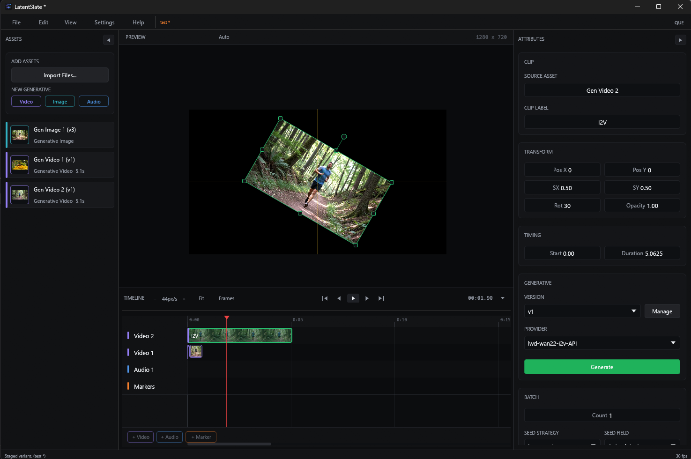

# LatentSlate

**From latent space to timeline.**

A local-first generative NLE desktop app supporting a range of generation providers, starting with ComfyUI and your own workflows. By [Enviral Design](https://www.enviral-design.com/).


<p align="center">

</p>



<p align="center">


</p>






## The Gap

ComfyUI is excellent for graph-based generation, but it is not a timeline editor. Traditional NLEs are excellent timeline editors, but they are not built around iterative AI generation, prompt/schema inputs, versioned outputs, or workflow-specific provider wiring.

LatentSlate is exploring the missing middle: a fully local, Rust-native NLE with a streamlined and opinionated UX combined with a deliberately unopinionated provider system that can support many APIs, while treating ComfyUI as the intended first-class pathway.

The goal is to let you build and test your workflow in ComfyUI, then bring it into LatentSlate exposing only the parameters and settings you need to care about to create, version, and iterate on your vision.

## What Stands Out

- **Generation lives on the timeline.** Image, video, and audio generations become project assets with active versions, timeline clips, and reusable media references instead of one-off files scattered outside the edit.
- **Asset Lab keeps iteration visible.** Generated attempts, staged variants, branches, and media-reference links are shown as lineage so a prompt tweak, seed change, provider swap, or I2I/I2V continuation has a clear origin.
- **ComfyUI stays powerful without exposing the whole graph.** The Provider Builder lets you import API workflow JSON, choose the output node, and expose only the inputs that should become creator-facing controls.
- **Timeline context can feed generation.** A selected clip, active version, first frame, last frame, or pinned media reference can become the input to the next provider run.
- **Content transforms are first-class editing controls.** Clips support position, scale, rotation, opacity, snapping, transform handles, and preview-space manipulation alongside the generative controls.
- **Preview performance is part of the design.** The app uses FFmpeg-backed decode, optional hardware decode, bounded frame caching, cached thumbnails, waveform caches, and preview diagnostics so iteration stays interactive as projects grow.
- **The project folder is the source of truth.** Imported media, generated outputs, config JSON, versions, exports, and caches are organized locally so work remains inspectable and portable.
- **Automation tests drive the real desktop app.** The loopback smoke harness talks to registered egui widgets and editor operations instead of relying on hidden parallel UI paths.

## What It Is Today

- Windows-first Rust/egui desktop app.
- Project-local asset import for images, audio, and video.
- Timeline with video, audio, and marker tracks.
- Preview panel with transform handles, cached thumbnails, audio waveforms, playback, scrubbing, optional hardware decode, and diagnostics.
- Generative image/video/audio assets with config files and version history.
- Asset Lab for visual generation lineage, staged variants, provider changes, and branch exploration.
- Generation queue with progress, status feedback, and cancellation.
- ComfyUI Provider Builder for turning API workflow JSON into timeline-editable provider inputs.
- Experimental OpenAI image, xAI image, and xAI video adapters.
- FFmpeg-backed MP4 export with optional audio mixdown.

The accurate status, limitations, and roadmap are in [docs/PROJECT.md](./docs/PROJECT.md).

## ComfyUI First

The main open-source provider path is bring-your-own ComfyUI:

1. Build and test a workflow in ComfyUI.
2. Export it as API JSON.
3. Open the Provider Builder in the app.
4. Pick an output node and expose only the inputs you want on the timeline.
5. Generate versions directly into the project.

See [docs/PROVIDERS.md](./docs/PROVIDERS.md) for setup, manifest behavior, and current adapter limits.

## Try It

There is no installer yet. Current builds are source-first.

```powershell
git clone <repository-url>
cd <repository-folder>

cargo check
.\scripts\build-and-stage.ps1 -Profile release
.\target\release\latentslate.exe
```

You will need Rust stable, FFmpeg development/runtime libraries for `ffmpeg-next`, `ffmpeg.exe` on `PATH` for export, and optionally a local ComfyUI instance at `http://127.0.0.1:8188`. The runtime staging script reads the built executable's DLL imports and copies the matching app-local dependency closure from `VCPKG_ROOT`, `C:\vcpkg2`, `C:\vcpkg`, or an explicit `-SourceBin`.

Local runtime state lives under `.latentslate/` in this repository folder. The directory skeleton is tracked, but provider JSONs, encrypted credentials, and caches are ignored so the app stays inspectable without committing private state.

## Documentation

- [Current status, roadmap, and decisions](./docs/PROJECT.md)
- [Architecture overview](./docs/ARCHITECTURE.md)
- [Provider and ComfyUI guide](./docs/PROVIDERS.md)
- [Desktop automation harness](./docs/DESKTOP_TEST_HARNESS.md)
- [Contributing](./CONTRIBUTING.md)
- [Security](./SECURITY.md)

## Contributing

This project is most useful to ComfyUI power users, AI video creators, Rust desktop contributors, and people willing to test rough Windows builds.

Good early contribution areas: ComfyUI workflow compatibility, provider adapters, export validation, tests/CI, platform bring-up, and sanitized demo assets.

Start with [CONTRIBUTING.md](./CONTRIBUTING.md).

## License

MIT. See [LICENSE](./LICENSE). Created by Enviral Design with contributors.
